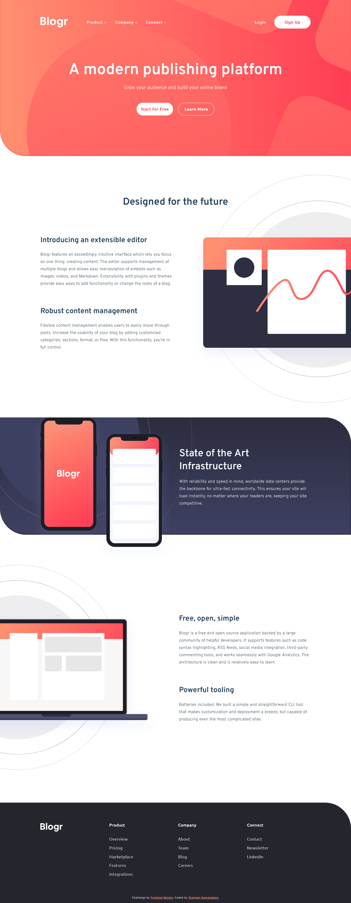

# Frontend Mentor - Blogr landing page solution

This is a solution to the [Blogr landing page challenge on Frontend Mentor](https://www.frontendmentor.io/challenges/blogr-landing-page-EX2RLAApP). Frontend Mentor challenges help you improve your coding skills by building realistic projects. 

## Table of contents

- [Overview](#overview)
  - [The challenge](#the-challenge)
  - [Screenshot](#screenshot)
  - [Links](#links)
- [My process](#my-process)
  - [Built with](#built-with)
  - [What I learned](#what-i-learned)
  - [Continued development](#continued-development)
  - [Useful resources](#useful-resources)
- [Author](#author)
- [Acknowledgments](#acknowledgments)

## Overview

The challenge was similar to the sunnyside landing page challenge from the frontend mentor and it helped my skill to little more solid. From this challenge realized the more you do the same thing you find a different way to optimize the code and reduce the error you keep making which may lead to taking more time to complete the project.

### The challenge

Users should be able to:

- View the optimal layout for the site depending on their device's screen size
- See hover states for all interactive elements on the page

### Screenshot

### Links

- Solution URL: [Click here](https://github.com/shameerkamaludeen/blogr-landing-page)
- Live Site URL: [Click here](https://shameerkamaludeen.github.io/blogr-landing-page/)

## My process

### Built with

- Semantic HTML5 markup
- Flexbox
- CSS Grid
- Mobile-first workflow

### What I learned

Got the opportunity to thorough my knowledge on how to design an entire landing page, able to think about how to improve optimizing the code which may reduce the time to complete the task as well.

### Continued development

- Will have a structured way to develop the website as responsive 
- The time required to complete the project needs to be reduced by analysing how to approach the task before starting itself. 
- Need to improve the positioning of the element

### Useful resources

- [Flexbox](https://developer.mozilla.org/en-US/docs/Learn/CSS/CSS_layout/Flexbox)
- [Grids](https://developer.mozilla.org/en-US/docs/Learn/CSS/CSS_layout/Grids)
- [Responsive design](https://developer.mozilla.org/en-US/docs/Learn/CSS/CSS_layout/Responsive_Design)
- [Positioning](https://developer.mozilla.org/en-US/docs/Learn/CSS/CSS_layout/Positioning)

## Author

- Github - [Shameer Kamaludeen](https://github.com/shameerkamaludeen)
- Frontend Mentor - [@shameerkamaludeen](https://www.frontendmentor.io/profile/shameerkamaludeen)
- Twitter - [@ShameerKamalud1](https://twitter.com/ShameerKamalud1)

## Acknowledgments

Thanks to the frontend mentor who did a wonderful job. They know how to make us gradually improve and make our skills firm within us. Their challenges are well crafted, making us know every part of the development we are required to learn to be a professional.